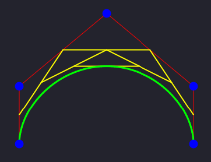

# Bézier Curves
An implementation of Bézier curve rendering and manipulation, using the HTML5 Canvas API.



## How does it work?
Bézier curves can be simply explained as nested linear interpolations.

### What is Interpolation?
Interpolation is defined as "The process of finding, from the given values of a function for certain values of the variable, its approximate value for an intermediate value of the variable."

Simply put, it is a function where you can plug in a start point, end point, and a percentage to get a point in between the start and end.

Interpolation can follow virtually any function, such as a Sigmoid curve, spherical interpolation (a.k.a. 'slerp'), and many more.

The type of interpolation used to create Bézier curves is linear, where a change in that percentage is proportional to the outputted value. This is commonly referred to as 'lerp'.

So, for example, if you were trying to find the midpoint of 10 and 20:
```js
// This will linearly interpolate between 'start' and 'end' with the percentage 't'.
function lerp(start, end, t) {
    return (1 - t) * start + t * end;
}

const midpoint = lerp(10, 20, 0.5); // 0.5 = 50%, a.k.a. halfway from 10 to 20.
console.log(midpoint); // This should print 15.
```

If you're still confused, see [Interpolation](https://en.wikipedia.org/wiki/Interpolation).

### What are Bézier Curves?

Bézier curves are constructed using at least 3 control points, up to an infinite amount of control points.

These curves are classified by their 'degree', which is found by `number of control points - 1`. 

- A curve with 3 control points has a degree of `2`
- A curve with 4 control points has a degree of `3`
- A curve with 5 control points has a degree of `4`
- etc. for higher degrees

Curves also have common names: 
- (degree `2`) Quadratic
- (degree `3`) Cubic
- (degree `4`) Quartic
- (degree `5`) Quintic
- etc. for higher degrees

These curves are aptly named; they form curves similar to the curves that polynomials of the same degree would form. 

For example, a quadratic Bézier curve (degree 2) forms a curve that is comparable to a quadratic polynomial such as `f(x) = 2x^2 + 3x - 4`, and a cubic Bézier curve (degree 3) forms a curve that is comparable to a cubic polynomial such as `f(x) = 4x^3 + x^2 - 3x + 7`.

Bézier curves are calculated by recursively interpolating along the vectors that connect the control points.

For example, to interpolate between two points:
```js
// This linearly interpolates between two 2D coordinates.
function lerpXY(x0, y0, x1, y1, t) {
    return [
        (1 - t) * x0 + t * x1,
        (1 - t) * y0 + t * y1
    ];
}

// 0.5 = 50%, a.k.a. halfway from (10, 10) to (20, 20)
const intermediatePoint = lerpXY(10, 10, 20, 20, 0.5);
console.log(intermediatePoint); // This should print [ 15, 15 ].
```

After finding the interpolated points, these can be connected to form new vectors. There will be one less interpolated vector after each iteration, so after a sufficient number of iterations for the curve's degree will condense the interpolated value into a single point. This point is then rendered to form that point of the curve.

And then the process repeats for every value of `t`, which forms the shape of the curve.

If you're still confused, see [Bézier Curve](https://en.wikipedia.org/wiki/B%C3%A9zier_curve).
